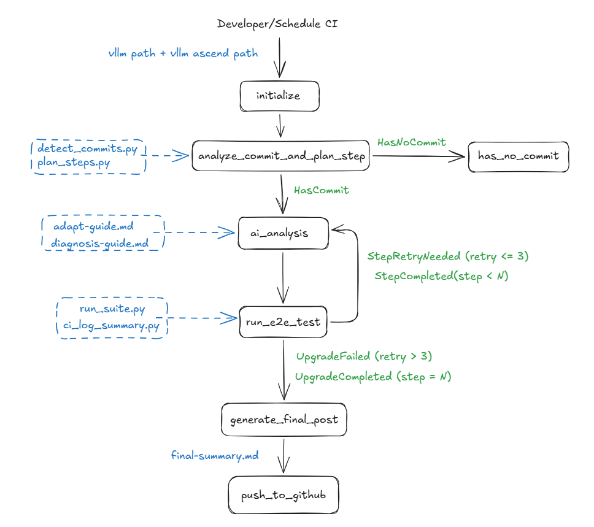

# Main2Main Flow — 使用指南

## 背景与目标

vllm-ascend 是 vLLM 的昇腾（Ascend NPU）硬件适配插件，其代码以 vLLM 的某个特定 commit 为基础，通过继承和覆写 vLLM 内部接口来实现昇腾硬件支持。随着 vLLM 上游 main 分支持续演进，接口签名、内部类结构、配置项等会不断变化，vllm-ascend 必须跟随这些变化做出相应适配，否则就会出现运行时错误甚至编译失败。

这个同步过程被称为 **main2main 升级**。每次升级本质上是：

1. 找出 vLLM 从"当前已同步版本"到"目标版本"之间新增的所有 commit
2. 分析这些 commit 改动了哪些接口或内部实现
3. 在 vllm-ascend 中做出对应修改，确保适配层与新版 vLLM 保持兼容
4. 跑 e2e CI 验证修改是否正确
5. 通过后提交 PR

过去这个过程完全靠人工完成，耗时且容易遗漏。**Main2Main Flow** 将其自动化：它由确定性脚本（commit 检测、步骤规划、版本引用更新、CI 校验）与 AI Agent（通过 `opencode` 驱动的单 agent 工作流）协同驱动，全流程无需人工介入即可完成一次 vLLM 版本升级。

---

## 快速开始

### 前置条件

- Python 3.10–3.13
- 已安装 [crewAI](https://github.com/joaomdmoura/crewAI)（`pip install crewai`）
- 已安装 [opencode](https://opencode.ai) CLI 工具，并设置 `MAIN2MAIN_MODEL`（opencode 的 `provider/model` 标识；只要 AI agent 会运行就必须设置）
- 本地已有 vllm 和 vllm-ascend 的 git 仓库（工作树需干净），或可以访问 GitHub 进行 clone
- 如需运行 e2e 测试：目标机器上有昇腾 NPU 设备，并配置好 Docker 容器环境
- 如需自动推 PR：已安装并登录 `gh`（GitHub CLI）

### 安装

```bash
# 进入项目目录
cd main2main_flow

# 安装 crewAI 和项目依赖
pip install crewai
pip install -e .
```

安装完成后，`kickoff` 命令会被注册为可执行入口。

### 运行方式

**方式一：直接指定本地仓库路径**

```bash
MAIN2MAIN_MODEL=anthropic/claude-sonnet-4-6 \
kickoff \
  --vllm-path /path/to/vllm \
  --vllm-ascend-path /path/to/vllm-ascend
```

这是最常见的用法。两个仓库必须是已经 clone 好的本地 git 仓库，vllm 仓库的 HEAD 即为目标版本。

**方式二：指定升级目标 commit**

```bash
kickoff \
  --vllm-path /path/to/vllm \
  --vllm-ascend-path /path/to/vllm-ascend \
  --target-commit a1b2c3d4e5f6...  # 40 位 SHA
```

不传 `--target-commit` 时，默认跑到 vllm 仓库当前 HEAD。如果你希望只同步到某个中间版本而不是最新 HEAD，可以手动指定。

**方式三：传 GitHub URL（自动 clone）**

```bash
kickoff \
  --vllm-path https://github.com/vllm-project/vllm.git \
  --vllm-ascend-path https://github.com/vllm-project/vllm-ascend.git
```

如果本地没有仓库，可以直接传 GitHub URL。Flow 会在启动时自动 clone 到项目根目录的 `repo_cache/` 下，后续操作均在 clone 出来的副本中进行。`repo_cache/` 跨运行持久保留：复用已有缓存时会 fetch 并硬重置到 `origin/HEAD`（缓存副本由 Flow 全权管理，不要把它指向你自己维护的工作检出）。

**方式四：使用环境变量（适合 CI 脚本）**

```bash
export VLLM_PATH=/path/to/vllm
export VLLM_ASCEND_PATH=/path/to/vllm-ascend
export PUSH_TO_GITHUB=true
export GITHUB_REPO=vllm-project/vllm-ascend

kickoff
```

所有 CLI 参数都有对应的环境变量，适合在 CI/CD 流水线中使用。

### 跳过特定阶段

```bash
# 跳过 e2e 测试（仅验证 AI 适配结果）
SKIP_E2E_TEST=true kickoff \
  --vllm-path /path/to/vllm \
  --vllm-ascend-path /path/to/vllm-ascend

# 跳过 AI 分析（仅验证管道：commit 检测、步骤规划；每步不做 checkout / 引用替换）
SKIP_AI_ANALYSIS=true kickoff \
  --vllm-path /path/to/vllm \
  --vllm-ascend-path /path/to/vllm-ascend
```

跳过 e2e 测试时，所有步骤在 AI 适配、pre-CI 校验和 critic 评审通过后即视为完成，不会真正执行 NPU 测试。跳过 AI 分析时，每步直接跳到 e2e 测试阶段：不做 vllm checkout、不做 commit 引用替换、也不运行 opencode agent（此时无需设置 `MAIN2MAIN_MODEL`），主要用于验证流程管道本身。

### 环境变量完整说明

| 变量 | 说明 | 默认值 |
|---|---|---|
| `VLLM_PATH` | vllm 本地路径或 GitHub URL。CLI `--vllm-path` 优先级更高 | — |
| `VLLM_ASCEND_PATH` | vllm-ascend 本地路径或 GitHub URL。CLI `--vllm-ascend-path` 优先级更高 | — |
| `VLLM_TARGET_COMMIT` | 目标 vllm commit SHA（40 位）。不设置则以 vllm HEAD 为目标 | vllm HEAD |
| `MAIN2MAIN_MODEL` | opencode 的 `provider/model` 标识（如 `anthropic/claude-sonnet-4-6`）。**只要 AI agent 会运行就必须设置**，否则适配器直接报错 | — |
| `SKIP_E2E_TEST` | 设为 `true` 跳过所有 e2e NPU 测试，所有步骤直接视为通过 | `false` |
| `SKIP_AI_ANALYSIS` | 设为 `true` 跳过 AI 分析阶段（每步不做 checkout / 引用替换，直接进入 e2e），用于验证流程管道 | `false` |
| `MAIN2MAIN_CRITIC` | 设为 `false` 跳过 pre-CI 通过后的独立 critic 评审 | `true` |
| `PUSH_TO_GITHUB` | 设为 `true` 在全部步骤成功后自动创建 PR | `false` |
| `GITHUB_REPO` | PR 目标仓库，格式 `owner/name`（如 `vllm-project/vllm-ascend`） | — |
| `MAIN2MAIN_REMOTE_HOST` | e2e 测试远程机器的 SSH 地址（如 `root@192.168.1.10`）。不设置则在本机执行 | — |
| `MAIN2MAIN_REMOTE_CONTAINER` | 远程机器上已存在的 Docker 容器名，测试命令将通过 `docker exec` 在其中运行。与 `MAIN2MAIN_REMOTE_HOST` 同时设置时自动启用远程模式（等价于 `MAIN2MAIN_RUN_TESTS_REMOTE=env`） | — |

以上只是最常用的变量。完整列表（按模式覆盖模型、超时、镜像、时间预算、PR 去重、测试兜底等）见 README 的 "Environment variables" 一节。

---

## 工作流总览

整个 Flow 由 5 个节点组成，核心是一个针对每个步骤的"适配 → 测试 → 重试"循环。



`initialize` → `analyze_commit_and_plan_step` → `process_steps`（循环 `_ai_analysis` + `_run_e2e_test`，最多重试 3 次）→ `generate_final_post` → `push_to_github`

Flow 的路由信号只有两个：`HasCommit` / `HasNoCommit`（`analyze_commit_and_plan_step` 这个 `@router` 节点的返回值）。`UpgradeCompleted` / `UpgradeFailed` 并不是路由信号，而是写入 `state.final_status` 的最终状态值，供 `generate_final_post` 和 `push_to_github` 读取。这四个常量都定义在 `utils.py` 中。

---

## 各步骤详解

### Step 1 — `initialize`

**触发条件**：Flow 入口，由 `@start` 装饰，是整个工作流第一个执行的节点。

**核心功能**

初始化阶段负责清理工作区、规范化路径和若干前置检查。每次运行都会彻底删除并重建 `workspace/` 目录，确保本次运行的所有产物与上次运行完全隔离，不会因为残留文件干扰后续步骤的判断。

路径规范化逻辑如下：优先使用 CLI 参数，其次读取对应环境变量。如果最终得到的路径是一个 GitHub URL（以 `https://` 或 `git@` 开头），则自动 clone 到项目根目录的 `repo_cache/<name>`（已有缓存则 fetch 并硬重置到 `origin/HEAD`），并将本地路径记录到 state 中供后续节点使用。

前置检查与准备：

- **干净树检查**：两个仓库的工作树必须干净，否则直接报错终止；设置 `MAIN2MAIN_ALLOW_DIRTY=true` 可降级为告警继续。
- **目标引用解析**：设置了 `MAIN2MAIN_TARGET_REF`（如 `origin/main`）且未指定 target commit 时，先 fetch vllm 再把该引用解析为目标 SHA。
- **记录原始引用**：记下两个仓库当前的分支/commit（`original_vllm_ref` / `original_ascend_ref`），供 `generate_final_post` 结束时恢复。
- **时间预算**：按 `MAIN2MAIN_MAX_HOURS`（默认 12 小时，0 表示不限）记录全局截止时间，`process_steps` 在每步开始前检查。

**输入**

- CLI 参数 `--vllm-path`、`--vllm-ascend-path`、`--target-commit`（三者均可选）
- 或对应环境变量 `VLLM_PATH`、`VLLM_ASCEND_PATH`、`VLLM_TARGET_COMMIT`
- 若均未设置，`vllm_path` 和 `vllm_ascend_path` 默认为 `workspace/repos/vllm` 和 `workspace/repos/vllm-ascend`

**输出**

- 空的 `workspace/` 目录（旧目录已被删除）
- Flow state 中写入以下字段，供后续所有节点读取：
  - `state.vllm_path`：vllm 仓库的本地绝对路径
  - `state.vllm_ascend_path`：vllm-ascend 仓库的本地绝对路径
  - `state.target_commit`：目标 commit SHA（可能为空，表示以 vllm HEAD 为目标）

---

### Step 2 — `analyze_commit_and_plan_step`

**触发条件**：`initialize` 完成后，由 `@router` 装饰，执行完毕后根据结果路由到 `HasCommit` 或 `HasNoCommit`。

**核心功能**

这一步回答两个问题：

1. **需要同步多少内容？** — 找出 vllm-ascend 当前已同步到哪个 vllm commit，与目标 commit 对比，确定需要同步的范围。
2. **怎么分批同步？** — 如果范围很大（跨越几十个 commit），一次性全部适配风险太高，需要拆分成若干大小适中的步骤逐步推进。

#### 子步骤 2.1 — 检测 commit 范围（`detect_commits.py`）

base commit（当前 vllm-ascend 已适配并验证过的 vllm commit SHA）优先从 `.github/vllm-main-verified.commit` 文件读取（新格式）；该文件不存在时回退到 `docs/source/conf.py` 中硬编码的 `main_vllm_commit` 字段（旧格式）。两处的值都要求是严格 40 位十六进制 SHA，否则报错。

兼容版本 tag 从 `conf.py` 的 `main_vllm_tag` 字段读取（如 `v0.20.2`），用于后续 `vllm_version_is()` 版本 guard 的正确性校验。

检测逻辑：以上述 base 与 vllm 仓库 HEAD（或 `target_commit`）作为 target 对比。如果两者相同，说明已经同步到最新，返回 `HasNoCommit` 信号，流程直接结束；否则返回 `HasCommit`，继续规划步骤。

检测结果写入 `workspace/detect.json`：

```json
{
  "base_commit": "a1b2c3d4e5f6...",
  "target_commit": "f6e5d4c3b2a1...",
  "compat_tag": "v0.20.2"
}
```

#### 子步骤 2.2 — 规划适配步骤（`plan_steps.py`）

将 base 到 target 之间所有修改了 `vllm/` 目录的 commit 拆分为若干"步骤"（step）。拆分的目的是控制每一步的改动量，避免单次适配涉及过多文件变化导致 AI 分析不准或 CI 定位困难。

**分组算法**：

1. `git log --reverse base..target` 按时间正序列出所有 commit
2. 对每个 commit，使用 `git diff-tree --numstat` 仅统计 `vllm/` 目录下的增删行数
3. 跳过未修改 `vllm/` 的 commit（docs、tests、CI 脚本等不纳入步骤规划）
4. 分组规则（按优先级）：
   - **超大 commit 单独成步**：单个 commit 的 `vllm_changed_lines > 1000` 时单独成步，避免分析时上下文过长
   - **累积分组**：其余 commit 累积到当前步，当累积的 `vllm_changed_lines` 超过 1000 行（`LINE_BUDGET`），或 commit 数量达到上限 10 个（`COMMIT_COUNT_BUDGET`）时，将当前批次封装为一步，重新开始累积

   设置 `MAIN2MAIN_PLAN_EXCLUDES`（空格分隔的 git pathspec）可以把指定路径排除在行数统计、upstream.patch 和 changed_files.txt 之外。

这样规划出的每一步变更量适中，通常涵盖 1–10 个 commit，vllm 源码变更行数在 1000 行以内。

**输出**：
- `workspace/steps.json`：完整的步骤计划，每个步骤记录其包含的 commit 列表、commit 范围（`start_commit`、`end_commit`）、涉及的文件和总变更行数：

  ```json
  {
    "base_commit": "a1b2c3...",
    "target_commit": "f6e5d4...",
    "total_commits": 24,
    "steps": [
      {
        "id": "step-1",
        "index": 1,
        "start_commit": "a1b2c3...",
        "end_commit": "d4e5f6...",
        "commits": [
          {"sha": "b2c3d4...", "subject": "feat: add new attention backend option"},
          {"sha": "d4e5f6...", "subject": "refactor: split platform config"}
        ],
        "commit_count": 2,
        "vllm_changed_lines": 340,
        "files_changed": ["vllm/attention/backends/flash_attn.py", "vllm/config.py"]
      }
    ]
  }
  ```

- `workspace/steps/step-*/` 目录：每个步骤写入各自的产物：
  - `upstream.patch`：本步 vllm `vllm/` 目录的变更 diff
  - `changed_files.txt`：本步变更的文件路径列表
- `state.steps`：步骤列表写入 flow state，驱动后续循环迭代
- `state.release_tag`：兼容版本 tag（`compat_tag`），在整个适配过程中作为 `vllm_version_is()` 的版本基准

---

### Step 3 — `process_steps`（核心循环）

**触发条件**：监听 `HasCommit` 信号，由 `@listen` 装饰。

**核心功能**

这是整个工作流的核心循环，对每个步骤依次执行 AI 适配和 e2e 测试。每一步最多重试 3 次（AI 适配内部也有最多 3 次尝试）。循环体内部调用两个私有方法：`_ai_analysis` 和 `_run_e2e_test`。

---

### Step 3a — `_ai_analysis`

#### 准备阶段（确定性操作）

**1. checkout vllm 到本步目标 commit**

在开始分析之前，将 vllm 仓库 `git checkout` 到本步的 `end_commit`，确保后续 AI agent 读取 vllm 源码时看到的是与 upstream patch 对应的版本。

**2. 更新 commit 引用（`update_commit_reference.py`）**

vllm-ascend 在多个文件（`conf.py` 以及可能的其他配置文件）中硬编码了当前对齐的 vllm commit SHA。在每一步适配开始时，需要将这些旧 SHA 替换为本步的目标 SHA，以保持文档和配置的一致性。

具体做法：扫描 vllm-ascend 仓库所有被 git 追踪的文件（`git ls-files`，可用 `MAIN2MAIN_REF_UPDATE_PATHS` 限定范围），将文件内容中出现的旧 commit SHA 批量替换为新 SHA（严格 40 位十六进制）。这是纯文本替换，对二进制文件自动跳过。首轮（`retry_count == 0`）执行一次，重试轮次（`retry_count > 0`）跳过（因为引用已经在首轮更新过了）。

**3. 预填充 step_summary.md**

首轮时把上一步的累计 `step_summary.md` 内容复制到本步目录，agent 只需要追加本步的条目，不必重写此前步骤的内容。

#### AI 适配循环（最多 3 次 opencode 调用）

准备工作完成后，进入 AI 适配循环，每轮最多调用 3 次 opencode agent：

1. **模式选择**：第 1 次调用，若存在上一轮 e2e 测试错误则以 `fix` 模式运行，否则 `adapt`；第 2/3 次调用，若在修 e2e 错误或 critic 驳回则继续 `fix`，否则以 `fix_preci` 模式（专门修 pre-CI 违规的最小改动 prompt，模板自包含、不附带知识库）运行。
2. **存活检查**：opencode 进程异常退出/超时/没有产出事件（`agent_failed`），或 adapt/fix 模式下没有写出 `analysis.md`，都算本次调用失败，进入下一次调用。
3. **pre-CI 校验**：失败则把 `pre_ci_check.json` 反馈给下一次调用；3 次全部失败则本步本轮直接判失败（抛出 `StepFailure`，不再进入 e2e，消耗一次步骤级重试）。
4. **critic 独立评审**（`MAIN2MAIN_CRITIC` 非 `false` 时）：pre-CI 通过后，再启动一次只读的 opencode 评审调用（`review_prompt.md`，独立于写代码的 agent），对照 `review-lessons.md` §9 检查清单审查累计 diff（guard 方向、分支签名一致性、import 是否存在于新 vllm 树、注册表完整性等），把结论写入 `{step_dir}/review.json`。verdict 为 `fail` 时将 issues 反馈给下一次调用（`fix` 模式）；第 3 次仍被驳回则本轮判失败。critic 自身崩溃时记录告警并放行。

**调用方式**：通过 `subprocess.Popen` 启动 `opencode run --format json --dangerously-skip-permissions`，以 JSON 流式输出实时事件（agent 输出、工具调用等）。模型由 `MAIN2MAIN_MODEL`（可按模式用 `MAIN2MAIN_MODEL_ADAPT/_FIX/_REVIEW` 覆盖）指定，未设置直接报错。超时控制：总超时 30 分钟（`MAIN2MAIN_TIMEOUT_MIN`），输出静默超时 5 分钟（`MAIN2MAIN_STALE_SEC`）；静默超时后最多断点续跑 3 次——若已从事件流捕获到 opencode 会话 ID，则用 `--session <id>` 携带简短续跑提示恢复原会话，否则重发完整任务。

**AI agent 工作模式**

agent 在 `prompt.md` 中接收完整的任务上下文，包括：

| 输入 | 说明 |
|---|---|
| `patch_path` | 本步 `upstream.patch` 路径 |
| `changed_files_path` | 本步 `changed_files.txt` 路径 |
| `ascend_path` | vllm-ascend 仓库本地路径 |
| `vllm_path` | vllm 仓库本地路径 |
| `release_tag` | 兼容版本 tag（如 `v0.20.2`），用于 `vllm_version_is()` 校验 |
| `reference_dir` | 参考文档目录（知识库，见文末"AI Agent 参考文档"） |
| `mode` | `"adapt"`、`"fix"` 或 `"fix_preci"` |
| `error_logs` | fix / fix_preci 模式下传入的结构化错误日志文件路径列表 |
| `error_content` | 错误日志 + critic issues 的 JSON 内容直接内联进 prompt（截断至 8000 字符） |

**三种运行模式**

- **`adapt` 模式**（首次执行或新步骤）：agent 从 upstream patch 出发，分析上游改动并将其适配到 vllm-ascend：
  1. 读取 `changed_files.txt`，对照 `adapt-guide.md` 的 Key Areas 表确定受影响子系统
  2. 读取 `upstream.patch` 识别具体变更
  3. 使用 `code-structure-guide.md` 的 File Mapping 表找到对应 vllm-ascend 文件
  4. 实施修改，使用 `vllm_version_is("{release_tag}")` 进行版本兼容 guard
  5. 自我审查：验证所有变更、签名是否匹配、version guard 版本号是否正确
  6. 在 `step_dir` 下输出 `analysis.md`、`review.md`，向 `step_summary.md` 追加本步条目，最后写 `result.json`

- **`fix` 模式**（e2e 测试失败或 critic 驳回后）：
  1. 读取结构化 CI 错误日志（`round-<n>-result.json`）/ critic 的 `review.json`，区分 `code_bugs` 和 `env_flakes`
  2. 对每个 `code_bug`，对照 `diagnosis-guide.md` 的错误类型映射（TypeError → 签名变更、AttributeError → 配置字段变更、ImportError → 模块路径变更、NotImplementedError → 新增抽象方法）
  3. 在 `upstream.patch` 中搜索根因
  4. 映射到 `error-pattern-examples.md` 中的修复模式
  5. 实施修复

- **`fix_preci` 模式**（仅 pre-CI 失败后）：使用自包含的 `prompt_fix_preci.md` 模板，内联 pre-CI 失败内容和四条 pre-CI 政策说明，要求 agent 做**最小改动**修复违规、不做任何其他修改。

agent 的最后动作是写 `{step_dir}/result.json` 作为完成契约：

```json
{
  "status": "adapted",
  "files_touched": ["..."]
}
```

（`status` 为 `"adapted"` 或 `"noop"`。）适配器随后结合 `result.json`、`step_summary.md` 和 vllm-ascend 的 `git diff HEAD` 构造 `AdaptResult`（`modified_files` / `is_noop` / `status` / `agent_failed` 等字段），不再要求 agent 在对话末尾输出 JSON。

#### 每次 AI 完成后执行 pre-CI 校验（`pre_ci_check.py`）

pre-CI 校验是 AI 适配环节的"快速门"，在真正跑 NPU 测试之前用确定性规则拦截常见错误，共四项检查：

- **版本字符串检查**（`version_strings`）：扫描本次 `git diff HEAD` 中新增的行，找出所有 `vllm_version_is("...")` 调用，检查其中的版本号是否与 `release_tag` 完全一致。检查范围仅限新增行，不影响历史遗留的版本 guard
- **临时文件检查**（`temp_files`）：检查 vllm-ascend 工作区是否存在 `.patch`、`.log`、`.jsonl`、`vllm_changes.md` 等临时文件。这类文件若被误提交会污染仓库
- **格式检查**（`format`）：运行仓库自带的 `format.sh`，输出必须干净。若失败原因是格式化工具本身缺失（`command not found` / `No module named`），只记录不判失败——不能要求 agent 去修基础设施
- **import 检查**（`broken_imports`）：基于 AST 检查新增行上的 `from vllm...` import 是否能在目标 vllm 树中解析到；被 `vllm_version_is()` 分支或 `try/except ImportError` 包住的 import 视为合法的旧路径引用而跳过。无法 `ast.parse` 的文件本身就是违规（语法错误必须挡下）

校验失败时结果写入 `workspace/steps/<step-id>/pre_ci_check.json`（每次失败覆盖写入），并反馈给下一次 opencode 调用：

```json
{
  "all_passed": false,
  "checks": [
    {
      "name": "version_strings",
      "passed": true,
      "detail": "2 new vllm_version_is() calls all use v0.20.2"
    },
    {
      "name": "broken_imports",
      "passed": false,
      "detail": "1 broken import(s): ...",
      "violations": ["vllm_ascend/foo.py:12: from vllm.nope import X — module not found under .../vllm/"]
    }
  ]
}
```

**_ai_analysis 阶段的全部输出**（每步）：

| 文件 | 内容 |
|---|---|
| `workspace/steps/<step-id>/upstream.patch` | 本步 vllm 上游变更的完整 diff（仅 `vllm/` 目录，规划阶段写入） |
| `workspace/steps/<step-id>/changed_files.txt` | 本步变更的 vllm 文件名列表（规划阶段写入） |
| `workspace/steps/<step-id>/pre_ci_check.json` | pre-CI 校验失败时的结果（每次失败覆盖） |
| `workspace/steps/<step-id>/step_summary.md` | 累计的 AI 适配总结（预填充上一步内容 + 本步追加条目） |
| `workspace/steps/<step-id>/result.json` | agent 完成契约：`{"status": "adapted"\|"noop", "files_touched": [...]}` |
| `workspace/steps/<step-id>/review.json` | critic 评审结论（critic 运行过时存在） |
| `workspace/steps/<step-id>/step_target.patch` | vllm-ascend 累计变更（`git diff HEAD`，含此前步骤） |
| `workspace/steps/<step-id>/opencode-r<轮>-a<次>.log` | opencode 对话日志（按重试轮 r 和调用次 a 分文件，如 `opencode-r0-a1.log`） |
| `workspace/steps/<step-id>/opencode-r<轮>-a<次>_raw.jsonl` | opencode 原始 JSON 事件流 |
| `workspace/steps/<step-id>/opencode-r<轮>-a<次>_stderr.log` | opencode 子进程的 stderr 输出 |
| `workspace/steps/<step-id>/opencode-review-r<轮>-a<次>.log` | critic 评审调用的日志（另有对应 `_raw.jsonl` / `_stderr.log`） |
| `workspace/steps/<step-id>/analysis.md` | AI 输出的分析报告 |
| `workspace/steps/<step-id>/review.md` | AI 输出的自审查报告 |
| `workspace/steps/<step-id>/code-structure-guide.md` | 仅最后一步：agent 认为路由表过期时输出的更新版 |

同时更新 flow state：`state.cur_vllm_commit`、`state.cur_ascend_commit`、`state.cur_patch_path`、`state.changed_files`（本步变更文件列表，供测试精准选择），供 `_run_e2e_test` 使用。

---

### Step 3b — `_run_e2e_test`

**核心功能**

在真实的昇腾 NPU 环境中搭建测试环境，执行 e2e CI 测试，判断本步 AI 适配结果是否正确可用。支持本地执行和通过 SSH 在远程机器上执行。

#### 环境搭建

三种执行模式：

- **本地 in-place（Flow 默认的本地模式）**：Flow 管理的工作树本身就带着适配代码，因此只对 vllm `git checkout` 到 `cur_vllm_commit` 并以 `VLLM_TARGET_DEVICE=empty` 运行 `pip install .`（empty device 模式安装依赖但不编译 GPU 扩展，速度更快；有 `uv` 时优先用 `uv pip install`）；vllm-ascend 只校验 HEAD 等于 `cur_ascend_commit`，不做 fetch/reset/apply，然后安装 `requirements-dev.txt`。
- **本地独立检出**（`run_tests.py` 单独使用时）：clone（若不存在）或 fetch，vllm-ascend 要求干净树后 `git checkout --detach` 到 `cur_ascend_commit`，再 `git apply` step_target.patch，最后安装依赖。
- **远程**：上述独立检出流程被打包成一个 shell 脚本，通过 `ssh <host> docker exec <container> sh -c "..."` 在远端容器中执行，本地不需要有 NPU 环境。设置了 `MAIN2MAIN_REMOTE_HOST` + `MAIN2MAIN_REMOTE_CONTAINER` 时 Flow 自动走远程模式。

pip 镜像（清华 / 华为云）只在 `MAIN2MAIN_USE_CN_MIRRORS=true` 时配置；`SKIP_PIP_INSTALL=true` 可跳过所有安装。

#### 测试选择与调度

不再使用固定的测试套件表。测试按**文件级**选择与调度：

1. **测试选择**：优先使用 `MAIN2MAIN_TEST_CASES`（显式指定的测试路径）；否则把本步 vllm-ascend 变更文件列表交给 vllm-ascend 仓库自带的 `.github/workflows/scripts/select_tests.py`，解析其 `test_groups` 输出得到与变更相关的 e2e 测试文件（跳过 CPU-only 分组）。
2. **兜底**：若什么都没选出来，回退到 `MAIN2MAIN_SMOKE_TESTS` 指定的路径；仍为空时本轮记为 `skipped`（`tests_skipped=true`，`can_commit=true`），Flow 打出醒目告警——该步在**没有运行时验证**的情况下通过。
3. **调度**：每个测试文件按路径推断所需卡数（`one_card`/`singlecard` → 1、`two_card` → 2、`four_card` → 4 等），用贪心 first-fit 装箱塞进轮次并行执行，每个测试通过独立的 `ASCEND_RT_VISIBLE_DEVICES` 隔离设备。可用卡数自动探测（`/dev/davinci*`），也可用 `ASCEND_RT_VISIBLE_DEVICES` 限定。

每个测试的日志由 `ci_log_summary.py` 解析并分类：
- `passed`：所有用例通过
- `env_flake_pass`：有失败用例，但全部被识别为环境抖动（如 HCCL/ACL 初始化失败、NPU OOM），视为通过
- `failed`：存在代码 bug 导致的失败（`code_bugs_count > 0`）
- `summary_error`：日志解析失败，无法判断

只要任何一个测试报告 `failed`，整轮测试即为失败；全部为 `passed` / `env_flake_pass` 时视为通过。

**输出文件**（每步每轮次，`<n>` 为重试轮 `retry_count`）：

| 文件 | 内容 |
|---|---|
| `workspace/steps/<step-id>/tests/round-<n>-<test-slug>.log` | 单个测试文件的完整原始输出日志 |
| `workspace/steps/<step-id>/tests/round-<n>-<test-slug>-summary.json` | 单个测试的解析结果 |
| `workspace/steps/<step-id>/tests/round-<n>-result.json` | 本轮聚合结果（`can_commit`、`ci_result`、`tests_skipped`、各测试明细等）；失败时该文件路径作为结构化错误日志喂给下一轮 fix |

**重试逻辑**（在 `process_steps` 的 while 循环中实现）：

| 条件 | 行为 |
|---|---|
| 测试通过 | `current_step++`，`retry_count` 重置为 0，更新 `last_verified_vllm_commit`，进入下一步；若本步经历过重试，把错误→修复对追加到 `reference/candidates.md` |
| 测试失败或 AI 轮失败 | `retry_count++`，重新进入 `_ai_analysis`（fix 模式） |
| `retry_count` 达到 3 | 设置 `final_status = UpgradeFailed`（记录 `failure_reason`），退出循环进入 `generate_final_post` |

AI 轮失败（opencode 全部调用失败、pre-CI 三次未过、critic 三次驳回）与 e2e 测试失败消耗同一个 `retry_count`。此外每步开始前检查全局时间预算（`MAIN2MAIN_MAX_HOURS`），超时直接以 `UpgradeFailed` 收尾。任何异常都不会让 Flow 崩溃——失败原因写入 state 后仍会走到 `generate_final_post` 完成仓库恢复。

设置 `SKIP_E2E_TEST=true` 时，此方法不执行任何测试，直接返回 `True`（视为通过）。

---

### Step 4 — `generate_final_post`

**触发条件**：`process_steps` 完成后，由 `@listen` 装饰，无论升级成功还是中途失败都会执行。

**核心功能**

1. **汇总最终产物**：把最后一个成功步骤的 `step_target.patch`（累计 diff）复制为 `workspace/final_target.patch`；根据各步 patch 的逐文件差异做归因（一个文件只归到真正改动它的那一步），结合各步 `step_summary.md` 中的 Cause/Change 行生成 PR 正文 `workspace/final_summary.md`（每个文件附上游 commit 链接）。若最后一步输出了更新版路由表，复制为 `workspace/final_code-structure-guide.md`。
2. **写状态文件**：`workspace/final_status.json` 记录 `status`（completed/failed）、`steps_completed`/`steps_total`、`reached_commit`（最后通过 e2e 验证的 vllm commit）、`failure_reason`、所用 `model` 等。
3. **追加运行台账**：向项目根目录的 `runs-ledger.jsonl` 追加一行 JSON（时间、base/target、状态、步数、失败原因、模型），跨运行留痕。
4. **恢复仓库**：除非 `MAIN2MAIN_KEEP_BRANCH=true`，把 vllm 检出回 `original_vllm_ref`，对 vllm-ascend 先 `git reset`（清除 intent-to-add 记录）再 `checkout -f` 回 `original_ascend_ref`。恢复动作包在 try/except 里，失败只记日志、不影响已写出的状态文件。

**输出**：`workspace/final_summary.md`、`workspace/final_target.patch`、`workspace/final_status.json`、根目录 `runs-ledger.jsonl` 新增一行

---

### Step 5 — `push_to_github`

**触发条件**：`generate_final_post` 完成后（`@listen`），且 `PUSH_TO_GITHUB=true` 时执行。

**核心功能**

将本次升级的适配代码推送到 GitHub 并自动创建（或更新）Pull Request。这一步是可选的，需要显式设置 `PUSH_TO_GITHUB=true` 才会执行，否则打印提示后直接跳过，方便在不自动推送的场景下手动审查代码后再决定是否推。运行失败且 `MAIN2MAIN_KEEP_BRANCH=true` 时**拒绝推送**（工作树可能包含未通过验证的失败步骤改动）。

**执行流程**：

1. **确定分支**：默认开启 PR 去重（`MAIN2MAIN_PR_DEDUP=true`），复用固定分支 `main2main/auto-sync`，用 `--force-with-lease` 强推（先 fetch 远端分支尖到临时引用作为 lease 基准）；去重关闭时才使用时间戳分支 `update/main2main-<timestamp>`。`PR_BRANCH_NAME` 可显式覆盖。
2. **应用 patch 并提交**：`git apply workspace/final_target.patch`，跑一遍 `format.sh`，`git add -A` 后 `git commit -s`（工作树无变化时跳过 commit）。
3. **推送**：推到 `HEAD_FORK` 指定的 fork（未设置则推 origin）。
4. **创建或更新 PR**：去重模式下先 `gh pr list` 查找同一 head 的已开 PR，找到则 `gh pr edit` 更新标题和正文并返回其 URL；否则 `gh pr create`。标题形如 `[Misc]feat: adapt to vLLM main (<sha8>)`，部分完成的运行追加 `[partial k/n steps]` 并以最后验证过的 commit 作为 reached 侧。正文使用 `final_summary.md`，随后按 `PR_LABELS` 打标签。

**输出**：GitHub PR URL（打印到标准输出并作为节点返回值，同时写入 `/tmp/main2main/pr_url.txt`）

---

## 工作区目录结构

每次运行都会在项目根目录下创建（或覆盖）`workspace/` 目录。运行完成后目录结构如下：

```
workspace/
├── detect.json                           # 检测结果：base/target commit 和 compat_tag
├── steps.json                            # 完整步骤计划（仅元数据，不含 patch 正文）
├── final_summary.md                      # PR 正文：逐文件变更说明 + 上游 commit 链接
├── final_target.patch                    # 累计的 vllm-ascend 全量 patch
├── final_status.json                     # 状态、完成步数、reached commit、failure_reason、模型
├── final_code-structure-guide.md         # 仅当最后一步刷新了路由表时存在
└── steps/
    ├── step-1/
    │   ├── upstream.patch                # 本步 vllm 上游 diff（仅 vllm/ 目录，规划阶段写入）
    │   ├── changed_files.txt             # 本步变更的 vllm 文件路径列表
    │   ├── pre_ci_check.json             # pre-CI 校验失败结果（每次失败覆盖）
    │   ├── step_summary.md               # 累计的 AI 适配总结
    │   ├── result.json                   # agent 完成契约（status: adapted|noop）
    │   ├── review.json                   # critic 评审结论（critic 运行过时存在）
    │   ├── step_target.patch             # vllm-ascend 累计变更（git diff HEAD）
    │   ├── opencode-r0-a1.log            # opencode 对话日志（r<重试轮>-a<调用次>）
    │   ├── opencode-r0-a1_raw.jsonl      # opencode 原始 JSON 事件流
    │   ├── opencode-r0-a1_stderr.log     # opencode 子进程 stderr
    │   ├── opencode-review-r0-a1.log     # critic 评审调用日志（另有 _raw.jsonl / _stderr.log）
    │   ├── analysis.md                   # AI 分析报告
    │   ├── review.md                     # AI 自审查报告
    │   └── tests/
    │       ├── round-0-<test-slug>.log            # 单测试原始日志（retry_count=0）
    │       ├── round-0-<test-slug>-summary.json   # 单测试解析结果
    │       └── round-0-result.json                # 本轮聚合结果（can_commit、ci_result 等）
    ├── step-2/
    │   └── ...
    └── step-N/
        └── ...
```

每次运行开始时 `workspace/` 会被完全清空，因此如果需要保留上次运行的产物，请在运行前手动备份。

另有若干产物**持久保留在项目根目录**、跨运行累积：`repo_cache/`（URL 方式传入的仓库克隆）、`runs-ledger.jsonl`（每次运行一行的台账）、`.main2main.lock`（防并发锁文件），以及 `main2main_flow/reference/candidates.md`（失败→修复轮次自动追加的错误模式候选）。

---

## AI Agent 参考文档

AI agent 在分析和适配过程中会参考项目内置的参考文档，这些文档编码了 vllm-ascend 适配工作的领域知识，是 AI 分析质量的重要保障。文档位于 `main2main_flow/reference/`：

| 文件 | 主要内容 |
|---|---|
| `versioning-primer.md` | `vllm_version_is()` 的语义、release tag 的存放位置与推进时机、guard 方向规则（新上游行为放 `not vllm_version_is(...)` 分支） |
| `adapt-guide.md` | 上游变更类型 → 适配动作速查表、`vllm_ascend/patch/` 的适配方法、guard 生命周期、适配步骤指引 |
| `diagnosis-guide.md` | 常见 CI 错误类型的诊断流程：签名不匹配、import 错误、版本 guard 问题等，以及对应的修复模式 |
| `error-pattern-examples.md` | 具体错误案例和对应修复代码示例，帮助 agent 快速识别已知错误模式并套用正确的修复方法 |
| `review-lessons.md` | 历史评审教训；**§9 是 critic 评审用的操作性检查清单**（由 flow 提取喂给 review prompt） |
| `code-structure-guide.md` | File Mapping 路由表（flow 解析其标记块做最后一步的失效映射检查）和测试拓扑表 |
| `output-exemplars.md` | step_summary.md / analysis.md / review.md / result.json 的标准范例 |
| `ascend-constraints.md` | NPU 平台约束事实（HCCL、torch_npu/CANN、310P guard、graph mode、triton 可用性等，均附代码出处） |
| `upstream-ignore-paths.md` | 基本无需 Ascend 适配的上游子树清单（可供 `MAIN2MAIN_PLAN_EXCLUDES` 参考）及易混淆的例外 |
| `candidates.md` | 暂存文件：失败→修复轮次后由 flow 自动追加错误→修复对，人工筛选进 `error-pattern-examples.md` 后删除 |

adapt 模式的 prompt 内联 versioning-primer / adapt-guide / error-pattern-examples / review-lessons / output-exemplars；fix 模式把 adapt-guide 换成 diagnosis-guide；fix_preci 模式不附带知识库。`code-structure-guide.md` 不再内联，由 agent 按需读取。

这些文档随着项目演进应当持续维护，当出现新的适配错误类型或发现 agent 存在分析盲区时，应将相关经验沉淀到对应文档中，以提升后续运行的适配准确率。
