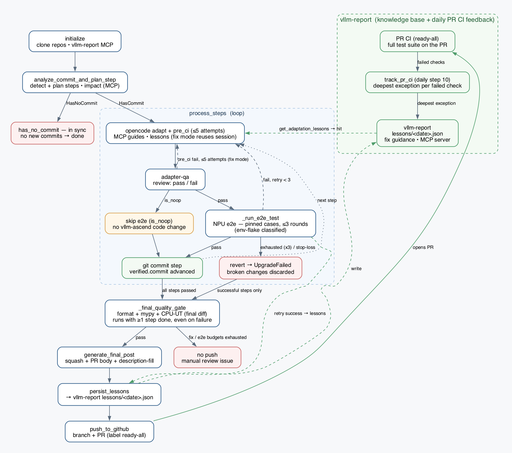

# Main2Main Flow — 使用指南

## 背景与目标

vllm-ascend 是 vLLM 的昇腾（Ascend NPU）硬件适配插件，其代码以 vLLM 的某个特定 commit 为基础，通过继承和覆写 vLLM 内部接口来实现昇腾硬件支持。随着 vLLM 上游 main 分支持续演进，接口签名、内部类结构、配置项等会不断变化，vllm-ascend 必须跟随这些变化做出相应适配，否则就会出现运行时错误甚至编译失败。

这个同步过程被称为 **main2main 升级**。每次升级本质上是：

1. 找出 vLLM 从"当前已同步版本"到"目标版本"之间新增的所有 commit
2. 分析这些 commit 改动了哪些接口或内部实现
3. 在 vllm-ascend 中做出对应修改，确保适配层与新版 vLLM 保持兼容
4. 跑 e2e CI 验证修改是否正确
5. 通过后提交 PR

过去这个过程完全靠人工完成，耗时且容易遗漏。**Main2Main Flow** 将其自动化：它由确定性脚本（commit 检测、步骤规划、版本引用更新、CI 校验）与 AI Agent（通过 `opencode` 驱动的单 agent 工作流）协同驱动，全流程无需人工介入即可完成一次 vLLM 版本升级。

整个系统还有一条**经验反馈闭环**：Flow 与 [vllm-report](https://github.com/vllm-ascend/vllm-report) 知识库协作——运行时 clone 该仓库并通过 MCP 动态查询历史适配经验（guides / lessons / impact analysis），每次运行的失败教训又会沉淀回 vllm-report 的 lessons，形成"经验复用 → 新教训 → 再复用"的循环。此外 vllm-report 的 `daily_refresh.sh` 会持续追踪 main2main PR 的 CI 结果（`track_pr_ci`），把 CI 失败摘要转成可供 adapter 查询的 lesson。

---

## 快速开始

### 前置条件

- Python 3.10–3.13
- 已安装 [opencode](https://opencode.ai) CLI 工具
- 本地已有 vllm 和 vllm-ascend 的 git 仓库，或可以访问 GitHub 进行 clone
- 如需运行 e2e 测试：目标机器上有昇腾 NPU 设备，并配置好 Docker 容器环境
- 如需自动推 PR：已安装并登录 `gh`（GitHub CLI）

### 安装

```bash
# 进入项目目录
cd main2main_flow

# 安装项目依赖
pip install -e .
```

安装完成后，`kickoff` 命令会被注册为可执行入口。

### 运行方式

**方式一：直接指定本地仓库路径**

```bash
kickoff \
  --vllm-path /path/to/vllm \
  --vllm-ascend-path /path/to/vllm-ascend
```

这是最常见的用法。两个仓库必须是已经 clone 好的本地 git 仓库，vllm 仓库的 HEAD 即为目标版本。

**方式二：指定升级目标 commit**

```bash
kickoff \
  --vllm-path /path/to/vllm \
  --vllm-ascend-path /path/to/vllm-ascend \
  --target-commit a1b2c3d4e5f6...  # 40 位 SHA
```

不传 `--target-commit` 时，默认跑到 vllm 仓库当前 HEAD。如果你希望只同步到某个中间版本而不是最新 HEAD，可以手动指定。

**方式三：传 GitHub URL（自动 clone）**

```bash
kickoff \
  --vllm-path https://github.com/vllm-project/vllm.git \
  --vllm-ascend-path https://github.com/vllm-project/vllm-ascend.git
```

如果本地没有仓库，可以直接传 GitHub URL。Flow 会在启动时自动 clone 到 `workspace/repos/` 目录下，后续操作均在 clone 出来的副本中进行，不影响任何已有目录。

**方式四：使用环境变量（适合 CI 脚本）**

```bash
export VLLM_PATH=/path/to/vllm
export VLLM_ASCEND_PATH=/path/to/vllm-ascend
export PUSH_TO_GITHUB=true
export GITHUB_REPO=vllm-project/vllm-ascend

kickoff
```

所有 CLI 参数都有对应的环境变量，适合在 CI/CD 流水线中使用。

### 跳过特定阶段

```bash
# 跳过 e2e 测试（仅验证 AI 适配结果）
SKIP_E2E_TEST=true kickoff \
  --vllm-path /path/to/vllm \
  --vllm-ascend-path /path/to/vllm-ascend

# 跳过 AI 分析（仅做确定性操作：commit 检测、步骤规划、引用更新）
SKIP_AI_ANALYSIS=true kickoff \
  --vllm-path /path/to/vllm \
  --vllm-ascend-path /path/to/vllm-ascend
```

跳过 e2e 测试时，所有步骤在 AI 适配和 pre-CI 校验通过后即视为完成，不会真正执行 NPU 测试。跳过 AI 分析时，只执行确定性操作（commit checkout、引用替换），不运行 opencode agent。

### 环境变量完整说明

| 变量 | 说明 | 默认值 |
|---|---|---|
| `VLLM_PATH` | vllm 本地路径或 GitHub URL。CLI `--vllm-path` 优先级更高 | `workspace/repos/vllm` |
| `VLLM_ASCEND_PATH` | vllm-ascend 本地路径或 GitHub URL。CLI `--vllm-ascend-path` 优先级更高 | `workspace/repos/vllm-ascend` |
| `VLLM_TARGET_COMMIT` | 目标 vllm commit SHA（40 位）。不设置则以 vllm HEAD 为目标 | vllm HEAD |
| `SKIP_E2E_TEST` | 设为 `true` 跳过所有 e2e NPU 测试，所有步骤直接视为通过 | `false` |
| `SKIP_AI_ANALYSIS` | 设为 `true` 跳过 AI 分析阶段，只做引用更新等确定性操作 | `false` |
| `PUSH_TO_GITHUB` | 设为 `true` 在全部步骤成功后自动创建 PR | `false` |
| `GITHUB_REPO` | PR 目标仓库，格式 `owner/name`（如 `vllm-project/vllm-ascend`） | — |
| `HEAD_FORK` | 推送目标 fork 仓库（默认 `vllm-ascend-ci/vllm-ascend`） | — |
| `GH_TOKEN` | GitHub PAT（CI 推送与 PR 创建必需） | — |
| `PR_LABELS` | PR 标签，逗号分隔（默认 `ready-all`，与 PR CI 全量触发对齐） | `ready-all` |
| `PR_DRAFT` | 是否创建 draft PR（默认 `true`） | `true` |
| `MAIN2MAIN_MODEL` | opencode 模型（默认 `deepseek/deepseek-chat`）。按角色覆盖：`MAIN2MAIN_MODEL_ADAPT`、`MAIN2MAIN_MODEL_FIX`、`MAIN2MAIN_MODEL_REVIEW` | `deepseek/deepseek-chat` |
| `MAIN2MAIN_TIMEOUT_MIN` | opencode 总超时分钟（默认 30） | `30` |
| `MAIN2MAIN_STALE_SEC` | opencode 输出静默超时秒（默认 300） | `300` |
| `MAIN2MAIN_WORKSPACE` | workspace 根目录（默认 `<repo>/workspace`） | `<repo>/workspace` |
| `MAIN2MAIN_TEST_CASES` | 空格分隔的测试用例列表 | — |
| `MAIN2MAIN_KEEP_BRANCH` | 设为 `true` 时跳过 vllm-ascend setup 的 `git reset --hard origin/main`，复用既有分支做增量 | `false` |
| `MAIN2MAIN_RUN_TESTS_REMOTE` | 在远程主机上执行 e2e（`user@host` 或 `env`） | — |
| `MAIN2MAIN_REMOTE_HOST`、`MAIN2MAIN_REMOTE_CONTAINER` | SSH 主机和容器名，远程 e2e 用 | — |
| `MAIN2MAIN_UT_SKIP_A2` | 设为 `true` 只跑 CPU-UT，跳过 A2 NPU UT batch | `false` |
| `MAIN2MAIN_UT_GATE` | 设为 `0` 跳过质量门禁中的 UT 检查（仅 format + mypy） | `1` |
| `SKIP_TRACK_PR_CI` | 跳过 vllm-report `daily_refresh.sh` 的 step 10（PR CI 追踪，见下文生态闭环） | `false` |

---

## 工作流总览

整个 Flow 由 `Main2MainFlow` 类（`main2main_flow/flow.py`）驱动，节点顺序为：

`initialize` → `_warmup_mega_moe` → `analyze_commit_and_plan_step` → `process_steps`（循环 `_ai_analysis` + `_run_e2e_test`，最多重试 3 次；全部成功后执行 `_final_quality_gate`）→ `generate_final_post` → `persist_lessons` → `push_to_github`

流程通过字符串信号传递控制权：`HasCommit`、`HasNoCommit`、`UpgradeCompleted`、`UpgradeFailed`，定义在 `scripts/utils/utils.py`。注意两个提前退出的分支：

- `HasNoCommit`：上游没有需要适配的新 commit，直接结束，不创建 PR
- **0 步完成**：`process_steps` 后若没有任何 step 通过 e2e（`current_step == 0`），不创建 PR（避免提交一个"失败描述 + 损坏 diff"的 PR），只生成 manual review issue



---

## 各步骤详解

### Step 1 — `initialize`

初始化阶段清理工作区并规范化路径。每次运行都会彻底删除并重建 `workspace/` 目录，确保本次运行的所有产物与上次运行完全隔离。

路径规范化逻辑：优先使用 CLI 参数，其次读取对应环境变量，最后使用默认值（`workspace/repos/<name>`）。如果最终得到的路径是一个 GitHub URL（以 `https://` 或 `git@` 开头），则自动执行 `git clone`。

`initialize` 还会：

- 保存 `original_vllm_ref` / `original_ascend_ref`（用作 PR squash 基线；squash 基线优先取 `refs/remotes/upstream/main` 指向的 SHA，即 workflow 中 rebase 到的上游 commit，避免把历次 run 的 sync commit 累积进 PR）
- 修复 `.github/workflows/scripts/gitleaks.sh` 的可执行权限（git 不追踪 +x，checkout 后需要 `chmod 755`，否则 format.sh 会误报失败）
- **clone vllm-report 知识库**（浅克隆到 `workspace/repos/vllm-report`），并安装其 MCP server 依赖（`mcp>=2.0.0`、`anyio>=4.0.0`）
- **配置并验证 opencode MCP**：把 vllm-report 的 MCP server 写入 opencode 配置（项目根 `opencode.json` + 全局 `~/.config/opencode/opencode.jsonc`，以 `python -m src.mcp_server_app` 启动），并在 init 时做 8s 启动探测，失败只告警不阻断

**输出 state 字段**：`vllm_path`、`vllm_ascend_path`、`target_commit`、`original_vllm_ref`、`original_ascend_ref`、`vllm_report_path`。

---

### Step 2 — `analyze_commit_and_plan_step`

回答两个问题：需要同步多少内容、怎么分批同步。

#### 子步骤 2.1 — 检测 commit 范围（`detect_commits.py`）

vllm-ascend 用 `.github/vllm-main-verified.commit`（fallback 到 `docs/source/conf.py` 的 `myst_substitutions.main_vllm_commit`）记录当前已适配并验证过的 vllm commit SHA（base commit）。`compat_tag` 同时给出对应的 vllm release tag（如 `v0.27.1`），用于 `vllm_version_is()` 版本 guard 的正确性校验。

检测逻辑：读取 verified commit 作为 base，读取 vllm 仓库 HEAD（或 `target_commit`）作为 target。若两者相同，返回 `HasNoCommit`，流程结束；否则返回 `HasCommit`，继续规划。

检测结果写入 `workspace/detect.json`。

#### 子步骤 2.2 — 规划适配步骤（`plan_steps.py`）

将 base 到 target 之间所有修改了 `vllm/` 目录的 commit 拆分为若干"步骤"（step）。拆分目的是控制每一步的改动量，避免单次适配涉及过多文件变化导致 AI 分析不准或 CI 定位困难。

**分组算法**：

1. `git log --reverse base..target` 按时间正序列出所有 commit
2. 对每个 commit，使用 `git diff-tree --numstat` 仅统计 `vllm/` 目录下的增删行数
3. 跳过未修改 `vllm/` 的 commit（docs、tests、CI 脚本等不纳入步骤规划）
4. **impact 分析路由**：若 vllm-report 数据可用，通过 MCP `get_commit_impact_batch` 批量查询每个 commit 是否影响 vllm-ascend（`ascend_affected`）。不影响 ascend 的 commit 记 0 行（`_effective_lines`），仅并入步骤推进 verified.commit，adapter 会把它判为 no-op
5. 分组规则（按优先级）：
   - **超大 commit 单独成步**：单个 commit 的 effective lines > `MAIN2MAIN_LINE_BUDGET`（默认 1000）时单独成步
   - **累积分组**：其余 commit 累积到当前步，当累积的 effective lines 超过预算，或 commit 数量超过上限（动态计算，基数 10）时，将当前批次封装为一步，重新开始累积

若所有 commit 都未修改 `vllm/`，会生成一个覆盖整个范围的 no-op step，确保 `verified.commit` 推进、e2e 仍会跑。

**输出**：
- `workspace/steps.json`：完整步骤计划
- `workspace/steps/step-*/` 目录：每步写入 `upstream.patch`（vllm 上游 diff）与 `changed_files.txt`（变更文件列表）
- `state.steps`、`state.total_steps`、`state.release_tag`

---

### Step 3 — `process_steps`（核心循环）

这是整个工作流的核心循环，对每个步骤依次执行 AI 适配和 e2e 测试。每步最多重试 3 次（AI 适配内部也有最多 3 次尝试）。循环体内部调用 `_ai_analysis` 和 `_run_e2e_test`。

#### Step 3a — `_ai_analysis`

**准备阶段**（确定性操作）：

1. `git checkout` vllm 到本步 `end_commit`，确保 AI agent 读取 vllm 源码时看到的是与 upstream patch 对应的版本
2. 调用 `update_commit_reference.py`：扫描 vllm-ascend 仓库所有被 git 追踪的文件，将文件内容中出现的旧 commit SHA 批量替换为新 SHA（严格 40 位十六进制）。首轮（`retry_count == 0`）执行一次，重试轮次跳过

**AI 适配循环**（最多 3 次 opencode 调用）：

每次循环调用 `opencode run` 启动一个 AI agent，然后执行 pre-CI 校验。pre-CI 通过则退出循环，否则将校验错误日志反馈给下一轮 agent，以 `fix` 模式重新适配，最多 3 次。

**调用方式**：通过 `subprocess.Popen` 启动 `opencode run --format json --auto`，以 JSON 流式输出实时事件。超时控制：总超时默认 30 分钟（`MAIN2MAIN_TIMEOUT_MIN`），输出静默超时默认 5 分钟（`MAIN2MAIN_STALE_SEC`）。session 模式复用：同一 step 的 attempt 2/3 与 stale timeout 重试都复用同一 opencode session，不重发 reference 全文。

**AI agent 工作模式**

agent 在 `agents/adapter/SKILL.md` 模板中接收完整任务上下文，包括：`patch_path`、`changed_files_path`、`ascend_path`、`vllm_path`、`release_tag`、`step_dir`、`mode`、`error_logs`（fix 模式）。

**两种运行模式**：

- **`adapt` 模式**（首次执行或新步骤，role=`adapter`）：agent 从 upstream patch 出发，分析上游改动并将其适配到 vllm-ascend。reference 注入 `adaptation-patterns.md` + `common-pitfalls.md` 全文，step-1 额外注入 `code-structure-guide.md`
- **`fix` 模式**（pre-CI 或 e2e 失败后，role=`adapter-fix`）：不重发 reference（已在 session 上下文中），只注入 `error_logs` 内联的错误日志内容（每文件截 16000 字符）

**MCP 知识库调用**：SKILL.md 明确 MCP 是 PRIMARY、grep 是 FALLBACK。adapter 在分析上游 patch 时优先调用 vllm-report 的 MCP 工具（`get_adaptation_guide`、`get_adaptation_lessons`、`get_cross_project_mapping`、`get_commit_impact_batch` 等），命中历史 lessons 后按沉淀的 fix_guidance 一次做对。CI 日志中 MCP 调用带 `[MCP] ←/→` 标记，便于核对是否真的在用知识库。

**pre-CI 校验**（`pre_ci_check.py`）是 AI 适配环节的"快速门"，在 NPU 测试前用确定性规则拦截常见错误：

- **version_strings**：扫描本次 `git diff upstream/main` 中新增的行，找出 `vllm_version_is("...")` 调用，检查版本号是否与 `release_tag` 一致
- **temp_files**：检查工作区是否有 `.patch`、`.log`、`.jsonl`、`vllm_changes.md` 等临时文件
- **broken_imports**：验证新增的 `from vllm.X import Y` 引用的模块在 vllm 源码树中存在；若在 `vllm_version_is` guard 内，自动补 `# type: ignore[import-not-found]`。同时检查 import 的**符号**在 pinned release 树（vllm-ascend 当前固定版本）中也存在——只存在于 main 的 unguarded import 会崩掉 release 分支
- **format**：跑快速格式检查（`_check_fast_format`），只报非自动修复类错误（ruff E501/F821/F841、codespell 等），过滤 gitleaks/shellcheck 环境噪声

（mypy 与完整 UT 检查不在每步的 pre-CI 里，而是在 push 前的 final quality gate 统一执行，见 Step 3c。）

校验结果写入 `workspace/steps/<step-id>/pre_ci_check.json`（每次尝试覆盖）。

**adapter-qa**（独立 critic）：仅在 pre_ci 通过后运行，用独立 opencode session 做对抗式 review，注入 `agents/adapter-qa/SKILL.md` + `review-lessons.md` 全文 + 当前 diff（截 8000 字符）+ upstream patch（截 4000 字符）。产出 `review.json`（`verdict`/`issues`），失败时写 `adapter-qa.md` 并把 issues 喂给 fix 模式。

**_ai_analysis 阶段的全部输出**（每步）：

| 文件 | 内容 |
|---|---|
| `workspace/steps/<step-id>/upstream.patch` | 本步 vllm 上游变更的完整 diff（仅 `vllm/` 目录） |
| `workspace/steps/<step-id>/changed_files.txt` | 本步变更的 vllm 文件名列表 |
| `workspace/steps/<step-id>/pre_ci_check.json` | pre-CI 校验结果（每次尝试覆盖） |
| `workspace/steps/<step-id>/step_summary.md` | AI 生成的本步适配总结（`AdaptResult.step_summary`） |
| `workspace/steps/<step-id>/step_target.patch` | vllm-ascend 本步全量变更（`git diff HEAD`） |
| `workspace/steps/<step-id>/opencode.log` | opencode agent 完整对话日志 |
| `workspace/steps/<step-id>/opencode_raw.jsonl` | opencode 原始 JSON 事件流 |
| `workspace/steps/<step-id>/opencode_stderr.log` | opencode 子进程 stderr |
| `workspace/steps/<step-id>/adapter-qa.md` | QA critic 发现的 issues（文本） |
| `workspace/steps/<step-id>/review.json` | QA critic 的结构化 verdict |
| `workspace/steps/<step-id>/opencode_qa.log` | QA session 对话日志 |
| `workspace/steps/<step-id>/opencode_qa_raw.jsonl` | QA session 原始事件流 |

同时更新 flow state：`cur_vllm_commit`、`cur_ascend_commit`、`cur_patch_path`、`changed_files`，供 `_run_e2e_test` 使用。

---

### Step 3b — `_run_e2e_test`

在真实的昇腾 NPU 环境中执行 e2e CI 测试套件。支持本地执行和通过 SSH 在远程机器上执行两种模式。

#### 环境搭建

1. **vllm 仓库**：clone（若不存在）或 fetch（若已存在），checkout 到 `cur_vllm_commit`，然后以 `VLLM_TARGET_DEVICE=empty` 运行 `pip install -e .`
2. **vllm-ascend 仓库**：clone 或 fetch，checkout 到 `cur_ascend_commit`
3. **应用 step_target.patch**：若存在 patch 文件，通过 `git apply` 应用到 vllm-ascend
4. **安装 vllm-ascend 依赖**：运行 `pip install -r requirements-dev.txt`

远程执行时，上述步骤被打包成一个 shell 脚本，通过 `ssh <host> docker exec <container> sh -c "..."` 在远端容器中执行。

#### 测试用例选择

测试用例来源（合并去重）：
1. `MAIN2MAIN_TEST_CASES` 环境变量（空格分隔）
2. `main2main_flow/test_policy.json` 的 `allowlist`（总是包含）与 `blocklist`（总是排除）
3. 若以上都为空，回退到按 `changed_files` 选择相关测试文件

#### 测试调度

`run_tests.py` 把每个 test 文件当作一个独立 suite 并行执行，按卡数贪心 bin-packing（first-fit decreasing），尽量将多个 suite 塞进同一轮次同时运行。每个 suite 分配到独立的设备 ID 范围，通过 `ASCEND_RT_VISIBLE_DEVICES` 环境变量隔离。不同轮次串行执行。

每个 suite 的测试结果由 `ci_log_summary.py` 解析日志并分类：
- `passed`：所有用例通过
- `env_flake_pass`：有失败用例，但全部被识别为环境抖动（env flake），视为通过
- `failed`：存在代码 bug 导致的失败（`code_bugs_count > 0`）
- `summary_error`：日志解析失败，无法判断

只要任何一个 suite 报告 `failed`，整轮测试即为失败；所有 suite 均为 `passed` 或 `env_flake_pass` 时，测试视为通过。

**输出文件**（每步每轮次）：

| 文件 | 内容 |
|---|---|
| `workspace/steps/<step-id>/tests/round-<n>-<slug>.log` | suite 完整原始日志 |
| `workspace/steps/<step-id>/tests/round-<n>-<slug>-summary.json` | suite 结构化摘要（`code_bugs`/`env_flakes`） |
| `workspace/steps/<step-id>/tests/round-<n>-result.json` | 本轮汇总（`can_commit`、`ci_result`、`suite_results`） |
| `workspace/steps/<step-id>/tests/round-<n>-test-errors.txt` | 失败 suite 的 summary + log tail（喂给 fix 模式） |

**重试逻辑**（在 `process_steps` 的 while 循环中实现）：

| 条件 | 行为 |
|---|---|
| adapter 判定 no-op（无 vllm-ascend 代码改动，`is_noop=true` 且首轮） | 跳过本步 per-step e2e，直接 commit（verified.commit 推进），`current_step++` |
| 测试通过 | `current_step++`，`retry_count` 重置为 0，进入下一步 |
| 测试失败，`retry_count < 3` | `retry_count++`，以 fix 模式重新进入 `_ai_analysis` |
| 测试失败，`retry_count >= 3` | revert 损坏的改动，设置 `final_status = UpgradeFailed`，退出循环进入 `generate_final_post` |

设置 `SKIP_E2E_TEST=true` 时，此方法直接返回 `True`（视为通过）。`_run_e2e_test` 的结果（含 `can_commit`/`ci_result`/逐 suite 摘要）写入 `tests/round-<n>-result.json`。

---

### Step 3c — `_final_quality_gate`

`process_steps` 全部步骤成功后、push 前执行的质量门禁，在**最终累计 diff** 上复刻 CI 的三个检查（format / mypy / UT），任何一项不过就进入 adapter fix 模式（最多 3 轮），每轮 fix 后重新确认。

- **format**：跑完整 `bash format.sh`
- **mypy**：`_check_mypy` 用 lint 等价的隔离 venv（`--system-site-packages` + 按 triton-ascend metadata 安装匹配的 numpy），对**固定版本树**和 **main 树**各跑一遍（`vllm_release_path` 存在时额外 +3 次调用，约 4 分钟），捕获只在 release 分支暴露的签名不匹配
- **UT**：`_check_ut`（`ut_check.py`）跑 CPU-UT（全部 `tests/ut/*` 中 CPU 路由的用例），每文件独立进程 + 假 npu-smi 注入（PATH 前置一个 `exit 1` 的 npu-smi 脚本，骗过 `tests/ut/conftest.py` 的 mock 检测），venv + 与 CI 一致的依赖，16 进程并行、每文件 300s 超时。A2 NPU UT 是单独 batch（`MAIN2MAIN_UT_SKIP_A2=true` 可跳过）。UT batch 内设置 `HF_HUB_OFFLINE=1` + `VLLM_USE_MODELSCOPE=True`，与 PR CI 的 cpu-0 runner 环境对齐

门禁失败进入 fix 模式时，错误详情（含 UT 失败用例的 traceback 摘要）通过 `error_logs` 喂给 adapter，修复后重新跑 e2e 回归确认没有破坏功能。

### Step 4 — `generate_final_post`

无论升级成功还是中途失败都会执行。做四件事：

1. **Squash step commits**：把 `process_steps` 期间累积的 per-step checkpoint commits 用 `git reset --soft original_ascend_ref` + `git commit` 压成单个 commit，确保 PR 只有一个 commit
2. **生成 PR body**：从各步 `step_summary.md` 提取 `Files`/`Upstream vLLM change`/`vllm-ascend adaptation` 三列表格，PR 日期取自 vllm target commit 的合入时间（非当前时间）。文件列表以 gate 后重新生成的**累计 patch** 为准（避免只显示最后一步）；未被 step_summary 归属的文件，调用 **description-fill** agent（只读分析 role）补齐归属分析
3. **回滚 verified.commit**：若 `last_verified_commit != target`，把 `.github/vllm-main-verified.commit` 回滚到最后一个 e2e 通过的 commit，确保失败运行不会把 baseline 指向未验证 commit
4. **0 步完成分支**：若 `current_step == 0`，写 `final_status.json`（`status: failed, steps_completed: 0`），不生成 PR body/patch

**输出**：`workspace/final_summary.md`（PR body）、`workspace/final_target.patch`、`workspace/final_status.json`

### Step 4.5 — `persist_lessons`

push 之前把本 run 的适配经验沉淀回 vllm-report 的 lessons（clone 每次重建，不先写就会丢）：

- 每步若经过 ≥1 轮 e2e fix（`retry_count >= 1`），调用 `submit_step_lesson` 记录该步的失败模式与最终修复
- `persist_lessons` 汇总本 run 全部 lessons，写入 vllm-report `data/vllm-ascend/lessons/<date>.json` 并推送

下次运行时 adapter 通过 `get_adaptation_lessons` 命中这些 lessons，避免重复踩坑。

---

### Step 5 — `push_to_github`

仅在 `PUSH_TO_GITHUB=true` **且至少有 1 步成功**时执行（0 步完成时 `flow.run` 直接跳过 push）。否则打印提示后跳过。

**执行流程**：

1. 找到 `workspace/final_target.patch`（或复用当前分支已有 commit）
2. 创建新分支 `main2main_auto_<timestamp>`（或 `MAIN2MAIN_KEEP_BRANCH=true` 时复用现有分支）
3. 应用 patch（若需），跑 `format.sh`，`git commit`（已有分支则 `--amend --no-edit`，把 format 修复合进现有 commit）
4. 推送到 fork 仓库（`HEAD_FORK`，默认 `vllm-ascend-ci/vllm-ascend`），`--force-with-lease`
5. 最后的安全网：`_git_push` 若检测到 `original_ascend_ref..HEAD` 多于 1 个 commit，会再次 force-squash 成单个 commit
6. `gh pr create` 创建 draft PR（最多重试 5 次），body 取自 `final_summary.md`
7. 添加 PR labels（默认 `ready-all`，触发 PR CI 全量测试）
8. 关闭旧的 main2main auto PR（按 title pattern 匹配）
9. 推送 `main2main_baseline` ref 到 fork，供下次增量运行
10. 清理旧的 `main2main_auto_*` 分支（保留最新 N 个，`MAIN2MAIN_KEEP_BRANCHES` 默认 3）

**输出**：GitHub PR URL（打印到 stdout 并写入 `/tmp/main2main/pr_url.txt`）

---

## 生态闭环（vllm-report）

Flow 的运行效果与 [vllm-report](https://github.com/vllm-ascend/vllm-report) 的每日刷新任务（`daily_refresh.sh`）互相加强：

```
main2main run → adapter 适配 → push PR → PR CI（ready-all 触发全量）
                                          ↓
                        daily_refresh step 10: track_pr_ci（最近 7 天 PR）
                        → pr_ci_results/<date>.json（失败 PR 的最深层异常）
                                          ↓
                        失败摘要转成 lessons → 写入 lessons/<date>.json
                                          ↓
                        下次 adapter 调 get_adaptation_lessons → 命中 → 一次做对
```

- **step 10 / track_pr_ci**：`gh` 搜索标题含 "adapt to vLLM main" 的 PR，拉取 CI check 结果，对失败 check 从日志提取最深异常（TypeError/ImportError/AttributeError/RuntimeError 等），写 JSON；支持 `--skip-track-pr-ci` 跳过。**去重**：已分析且 CI 结论未变的 PR 复用旧记录（`already_analyzed: true`），跳过日志拉取，把 5 分钟缩短到 ~1 分钟
- **lesson 命中**：adapter 的 MCP 调用是"经验复用 → 新教训 → 再复用"循环的关键一环。本仓库 `main2main_flow/scripts/utils/track_pr_ci.py` 与 vllm-report 的版本保持同步，方便在本仓库内维护/测试

---

## 工作区目录结构

每次运行都会在项目根目录下创建（或覆盖）`workspace/` 目录。运行完成后目录结构如下：

```
workspace/
├── detect.json                           # 检测结果：base/target commit 和 compat_tag
├── steps.json                            # 完整步骤计划
├── final_summary.md                      # PR body（Changes 表格）
├── final_target.patch                    # gate 后重新生成的累计 patch
├── final_status.json                     # 运行结果状态（status/steps_completed/old/new commit）
├── gate_final_patch                      # final quality gate 后重新生成的累计 patch（PR 描述事实来源）
├── repos/                                # 自动 clone 的仓库（仅在传入 GitHub URL 时存在）
│   ├── vllm/
│   ├── vllm-ascend/
│   └── vllm-report/                      # 知识库 + MCP server（每次运行重新 clone）
├── quality_gate/                         # final quality gate 产物（final_gate.patch 等）
└── steps/
    ├── step-1/
    │   ├── upstream.patch
    │   ├── changed_files.txt
    │   ├── upstream-fix-context.diff
    │   ├── pre_ci_check.json
    │   ├── analysis.md                   # adapter 的分析/修复过程记录
    │   ├── step_summary.md
    │   ├── step_target.patch
    │   ├── result.json                   # adapter 输出的结构化结果（status/files_touched）
    │   ├── opencode.log
    │   ├── opencode_raw.jsonl
    │   ├── opencode_stderr.log
    │   ├── adapter-qa.md
    │   ├── review.json
    │   ├── opencode_qa.log
    │   └── tests/
    │       ├── round-0-<slug>.log
    │       ├── round-0-<slug>-summary.json
    │       ├── round-0-result.json
    │       └── round-0-test-errors.txt
    ├── step-2/
    │   └── ...
    └── step-N/
        └── ...
```

每次运行开始时 `workspace/` 会被完全清空，因此如果需要保留上次运行的产物，请在运行前手动备份。

---

## AI Agent 参考文档

AI agent 在分析和适配过程中会参考项目内置的参考文档，这些文档编码了 vllm-ascend 适配工作的领域知识。文档位于 `main2main_flow/agents/`：

| 文件 | 角色 | 主要内容 |
|---|---|---|
| `adapter/SKILL.md` | adapter | 任务上下文、Rules、Guard 决策树、15 项完成前 checklist、Format rules、MCP PRIMARY 规则、fix mode 工作流、Output 规范 |
| `adapter/reference/adaptation-patterns.md` | adapter | 12 类上游变更模式的适配指引（constructor signature、new attribute、method signature change 等） |
| `adapter/reference/common-pitfalls.md` | adapter | 常见陷阱与修复（version guard 方向、import-not-found、[valid-type]、hit_length、Triton 参数、triton-ascend kernel 约束等）+ Additional QA-level checks + Fix mode workflow |
| `adapter/reference/code-structure-guide.md` | adapter | vllm-ascend 子系统静态映射表，仅 step-1 注入，用于代码定位 |
| `adapter-qa/SKILL.md` | adapter-qa | 独立 reviewer 任务规范、输出 `review.json` 的 JSON shape |
| `adapter-qa/reference/review-lessons.md` | adapter-qa | Review 最佳实践 §1-8（带经典案例）+ §9 Pre-Submit Checklist |
| `description-fill/SKILL.md` | description-fill | 只读分析 role：为 PR 描述中未被 step_summary 归属的文件补齐上游变更分析 |

这些文档随着项目演进应当持续维护，当出现新的适配错误类型或发现 agent 存在分析盲区时，应将相关经验沉淀到对应文档中，以提升后续运行的适配准确率。
